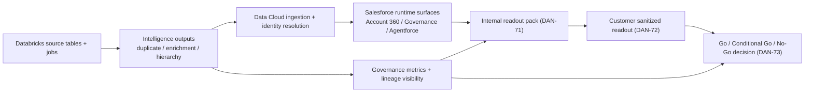

# DAN-70 Implementation Estimate and Resource Plan

## Scope and Evidence Baseline
- Linear issue: `DAN-70`
- Milestone: `Milestone E - End-to-End Demo Hardening`
- Evidence run ID used for extrapolation: `run_20260309_042146`
- Evidence sources:
  - `docs/evidence/datacloud-prerun-import-latest.md`
  - `docs/evidence/e2e-qa-latest.md`

Observed prototype evidence from the same run shows:
- end-to-end QA runtime `91` seconds (`<= 900` second target),
- DS-01 runtime `49` seconds, DS-02 runtime `27` seconds, DS-03 runtime `11` seconds,
- active intelligence outputs across four tables with non-zero rows and contract/runtime validator coverage.

## Effort Estimate (Prototype Evidence -> Implementation Plan)
Estimation model:
- Baseline effort uses observed build + validator surface from runtime evidence.
- Extrapolation multiplier (`x`) covers production controls not required in prototype: scale testing, CI/CD hardening, security controls, observability, rollback playbooks, and release readiness.
- Estimate units are person-weeks (pw).

| Workstream | Prototype evidence signal | Prototype effort (pw) | Extrapolation multiplier (x) | Implementation estimate (pw) | Confidence |
| --- | --- | ---: | ---: | ---: | --- |
| DS-01 duplicate intelligence productization | `duplicate_candidate_pairs` runtime checks pass with run metadata + failure-mode handling | 1.5 | 3.0 | 4.5 | Medium |
| DS-02 governance and enrichment productization | `firmographic_enrichment` + `governance_ops_metrics` runtime checks pass | 2.0 | 3.5 | 7.0 | Medium |
| DS-03 hierarchy + cross-sell action hardening | account 360 + quick-create runtime checks pass, degraded mode validated | 2.0 | 3.0 | 6.0 | Medium |
| Data Cloud ingest + activation hardening | pre-run import + stream/contract validators pass | 1.5 | 2.5 | 3.75 | Medium-High |
| Platform controls (lineage, governance, security gate) | lineage/governance config and runtime checks integrated | 1.0 | 2.5 | 2.5 | Medium |
| QA automation and demo reliability | E2E timing runner and walkthrough pack validators in place | 1.0 | 2.5 | 2.5 | Medium-High |

Total implementation estimate: **26.25 person-weeks** (planning range: **24-29 person-weeks**).

## Resource Plan (Role Matrix by Milestone)
Legend: average FTE allocation per milestone (`0.0` to `1.0`).

| Role | Milestone A | Milestone B | Milestone C | Milestone D | Milestone E | Notes |
| --- | ---: | ---: | ---: | ---: | ---: | --- |
| Product/Solution Lead | 0.4 | 0.5 | 0.5 | 0.5 | 0.7 | Scope, gate decisions, readout ownership |
| Databricks Data Engineer | 0.8 | 1.0 | 1.0 | 1.0 | 0.8 | Intelligence tables, jobs, contracts |
| Data Cloud Engineer | 0.4 | 0.8 | 1.0 | 1.0 | 0.8 | Ingestion, identity, activation mapping |
| Salesforce Engineer | 0.4 | 0.7 | 0.9 | 1.0 | 0.8 | LWC/actions/runtime UX contract conformance |
| Analytics Engineer / BI | 0.2 | 0.4 | 0.6 | 0.8 | 0.8 | Dashboard/readout packaging and metrics |
| QA / Demo Reliability | 0.1 | 0.2 | 0.4 | 0.8 | 0.8 | E2E timing, fallback, rehearsal discipline |
| Security / Governance | 0.2 | 0.3 | 0.4 | 0.5 | 0.4 | MCP gate, UC governance, access controls |

## Dependency Map

## Critical Path (Milestone E)
| Seq | Step | Primary owner | Blocking dependency | Exit criteria |
| ---: | --- | --- | --- | --- |
| 1 | Finalize implementation estimate + resource plan (DAN-70) | Product/Solution Lead | Latest runtime evidence (`run_20260309_042146`) | Estimate, role matrix, dependency map, critical path approved |
| 2 | Build internal readout dashboard pack (DAN-71) | Analytics Engineer | DAN-70 complete | Internal pack includes effort, risk, assumptions, gate status |
| 3 | Build customer sanitized readout (DAN-72) | Product/Solution Lead | DAN-71 complete | Customer-safe readout published without sensitive detail |
| 4 | Record decision and backlog conversion (DAN-73) | Product/Solution Lead | DAN-72 complete | Decision + follow-up backlog captured in Linear/Notion |

Critical path duration assumption: `~10` working days for Milestone E close once DAN-70 is accepted.

## Risk and Assumptions
| ID | Assumption | Validation status |
| --- | --- | --- |
| A1 | Runtime evidence remains representative for sizing through Milestone E close. | Partially validated (`run_20260309_042146`) |
| A2 | Deferred issues `DAN-58` and `DAN-59` stay out of critical path until richer dashboard visual state/data is available. | Accepted as deferred |
| A3 | Team can sustain combined peak load near `5.1` FTE during Milestone D/E overlap. | Not yet validated in staffing calendar |
| A4 | No new external compliance requirement is introduced before go/no-go decision. | Not validated |

## Acceptance Mapping (DAN-70)
- Estimate references measured prototype runtime and table/validator evidence: satisfied.
- Resource matrix by role and milestone: satisfied.
- Dependency map and critical path are explicit: satisfied.
- Output is ready for Solution Read Out input: satisfied (feeds `DAN-71`).
