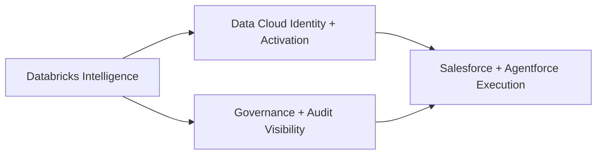

# Pulse360 Customer Readout (Sanitized)

## Executive Outcomes
Pulse360 demonstrates an end-to-end pattern that improves account intelligence quality, strengthens governance, and enables faster revenue action through Salesforce and Agentforce surfaces.

Outcome highlights from validated prototype evidence:
- Data quality posture improved through duplicate candidate detection and governed merge decisions.
- Group-level account visibility is available for cross-sell and coverage expansion workflows.
- Runtime reliability is established for live demo operation within the expected session window.

## Architecture Overview

Layer responsibilities:
- Databricks: intelligence preparation (duplicate signals, enrichment quality, hierarchy context).
- Data Cloud: identity unification and activation-ready profile context.
- Salesforce/Agentforce: user-facing actions, governance workflows, and seller guidance.

## Demo Proof Points
### DS-01: Fragmentation Discovery
- Duplicate confidence evidence is surfaced for merge review.
- Unified profile context supports downstream guidance for frontline teams.

### DS-02: Governance Case Resolution
- Comparison evidence supports human-approved merge decisions.
- Governance quality and operational trend signals are captured for oversight.

### DS-03: Account 360 Cross-Sell Moment
- Hierarchy context is available in-account for broader portfolio decisions.
- Cross-sell action flow is demonstrated with in-session refresh behavior.

### Operational Readiness Signals
- End-to-end timing checks are in place and validated from runtime evidence.
- Contract-backed payload checks are integrated across scenario surfaces.

## Roadmap and Delivery Shape
### Pilot scope (next phase)
- Run production-like pilot on a focused account cohort.
- Validate operational cadence for governance and cross-sell workflows.
- Confirm stakeholder adoption metrics for sales and operations users.

### V1 scope
- Expand coverage to larger account population and additional business units.
- Increase automation depth in governance routing and recommendation workflows.
- Formalize release gates and operating model for steady-state execution.

### Dependencies and timeline shape
- Dependency sequence: intelligence outputs -> identity/activation -> execution surfaces.
- Milestone focus: readout confirmation, customer-ready alignment, go/no-go decision.
- Timeline remains gated by evidence-backed decision checkpoints.

## Customer Review Narrative
- Business impact: better signal quality and clearer group-level visibility for account strategy.
- Delivery confidence: architecture and runtime proof indicate scalable progression.
- Governance confidence: traceability and review controls remain integral to the operating model.
- Presentation-ready summary: language is customer-safe, outcome-first, and implementation-detail sanitized.

## Evidence References (Sanitized)
- `docs/evidence/e2e-qa-latest.md`
- `docs/evidence/datacloud-prerun-import-latest.md`
- `docs/readout/internal-solution-readout-dashboard-pack.md` (internal source; this page is sanitized derivative)
