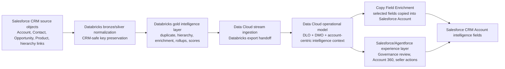

# Pulse360 Solution Goals, Architecture, and Implemented Design - 2026-03-28

## Document Purpose
This document is the comprehensive design narrative for the Pulse360 S4 prototype as it exists today.

It is intended to support critical review by describing:
- the business problem the solution is designed to solve
- the solution goals and intended business benefits
- the architecture elements and system responsibilities
- the detailed design decisions that shape the implementation
- what has already been built, validated, and proven in the live prototype
- where the implemented design differs from earlier assumptions

This is not a narrow troubleshooting note. It is the architecture-and-design explanation for the prototype as planned and as realized.

## Intended Audience
- solution architects reviewing end-to-end design quality
- platform architects reviewing Databricks, Data Cloud, and Salesforce responsibilities
- product and delivery reviewers assessing whether the implementation aligns to the original proposition
- future maintainers who need to understand what is already built versus what is still under review

## Executive Summary
Pulse360 is an account intelligence prototype designed to improve how teams understand, trust, and act on enterprise account data.

The business challenge is not a lack of raw account data. The challenge is that account records are fragmented, hierarchy context is weak, stewardship is slow, and commercially useful signals are hard to operationalize in Salesforce workflow.

The Pulse360 design addresses this by deliberately splitting responsibilities across three layers:
- Databricks computes trusted, explainable account intelligence
- Salesforce Data Cloud operationalizes that intelligence into a CRM-centered account model
- Salesforce CRM and Agentforce surfaces turn the intelligence into governed decisions and seller actions

The implemented design now proves the core value chain in the live prototype:
- Salesforce CRM source keys are preserved into Databricks
- Databricks produces enrichment and account-intelligence outputs
- Data Cloud ingests and models those outputs against CRM-safe account identifiers
- Salesforce CRM `Account` records receive intelligence values through Data Cloud `Copy Field Enrichment`

This last point is the most important architectural correction from the original troubleshooting path. The implemented CRM realization mechanism is `Copy Field Enrichment`, not the earlier assumed `ActivationTarget` path.

## 1. Business Problem and Product Intent

### 1.1 Core business problem
Enterprise account management is frequently constrained by four recurring operational failures:
- the same business entity appears as multiple conflicting CRM account records
- group relationships between parents, subsidiaries, brands, and related entities are not trusted or visible enough
- stewardship and governance decisions are slow because supporting evidence is fragmented across systems
- useful commercial signals do not become timely actions inside CRM workflow

The result is that teams make account decisions from partial truth:
- sellers do not know the real group context or whitespace
- planners cannot trust group-level coverage analysis
- stewards cannot make fast, defensible merge decisions
- leadership sees reporting, but not trusted account understanding

### 1.2 Product intent
Pulse360 is intended to create a trusted, explainable, action-oriented account intelligence foundation.

The solution is meant to help users answer five questions quickly and defensibly:
- who is this account really
- how is it connected to the wider business
- what is happening commercially
- how much should I trust this view
- what should I do next

### 1.3 Product thesis
Pulse360 only creates value if it turns fragmented account data into trustworthy account understanding, and then turns that understanding into action inside operational workflow.

The solution is therefore designed around four pillars:
- Account Truth
- Account Intelligence
- Account Trust
- Account Action

Those pillars are not abstract messaging. They directly inform the architecture:
- account truth requires CRM-safe keys, duplicate resolution, and hierarchy structure
- account intelligence requires computed signals and rollups
- account trust requires confidence, validity, lineage, and explanation
- account action requires CRM execution surfaces, decision workflow, and seller actions

## 2. Solution Goals and Business Benefits

### 2.1 Primary solution goals
The prototype is designed to achieve these concrete goals:

1. Establish a CRM-safe end-to-end account intelligence path.
- Native Salesforce `Account.Id` must survive ingestion, enrichment, export, Data Cloud modeling, and CRM writeback.

2. Turn Databricks into the accountable intelligence layer.
- Duplicate detection, hierarchy stitching, enrichment validity, and account-level scores should be computed in Databricks with traceability and run metadata.

3. Use Data Cloud as the CRM-centered operational intelligence layer.
- Data Cloud should not be treated as a passive pipe.
- It should provide the operational account model that links CRM-safe account identity with Pulse360 intelligence.

4. Surface intelligence inside Salesforce workflow.
- Intelligence must appear in CRM where stewards and sellers work, not only in analytical views.

5. Prove the three product scenario families.
- `DS-01` Fragmentation Discovery
- `DS-02` Governance Case Resolution
- `DS-03` Account 360 Moment

### 2.2 Business benefits

#### Benefits for Data Operations / stewardship
- faster duplicate-resolution decisions
- better confidence that merge decisions are based on traceable evidence
- lower manual effort reconstructing account truth from multiple systems
- better downstream account quality for selling and planning workflows

#### Benefits for sellers
- better visibility into account health, risk, whitespace, and group context
- less time spent gathering fragmented account context manually
- clearer next actions tied to real account intelligence rather than generic scoring

#### Benefits for planners and leaders
- better group-level revenue and whitespace visibility
- stronger coverage analysis across subsidiaries and related entities
- better prioritization because the account model is more structurally correct

#### Benefits for the delivery/program perspective
- explicit contracts across the system boundary
- clearer ownership of logic by platform layer
- stronger ability to validate, troubleshoot, and explain runtime failures

## 3. Scope and Scenario Coverage

### 3.1 Prototype scope commitment
The minimum viable architecture committed in project discovery is:
- Databricks intelligence layer for duplicate detection, hierarchy stitching, and enrichment validity scoring
- Data Cloud identity resolution and account-centered operationalization
- Salesforce and Agentforce execution surfaces using Data Cloud-backed insights
- contract-driven integration and validation artifacts

### 3.2 Scenario coverage

#### DS-01 Fragmentation Discovery
Objective:
- prove that fragmented account truth can be detected and contextualized

Expected elements:
- Databricks duplicate evidence
- Data Cloud unified profile / hierarchy context
- visible trust or validity indicators

#### DS-02 Governance Case Resolution
Objective:
- prove that a steward can make a decision-ready merge or review call with an audit trail

Expected elements:
- duplicate confidence
- explanation payload
- hierarchy impact
- governance case workflow
- structured approve / reject / defer behavior

#### DS-03 Account 360 Moment
Objective:
- prove that account intelligence and hierarchy context can change seller behavior

Expected elements:
- health and cross-sell context
- group rollup
- competitor and coverage signals
- action surface in Salesforce

### 3.3 Persona coverage
The design is explicitly shaped around three operational slices:
- stewardship slice
- seller slice
- planner slice

The first delivered slice is stewardship-heavy because it creates the trust foundation for the seller and planner slices.

## 4. Architecture Principles

The solution architecture is governed by the following decisions and constraints:

### 4.1 Contract-first design
- interfaces between platforms are described in repo contracts
- downstream UX is not allowed to depend on guessed or undocumented payloads
- validation scripts act as design enforcement, not only as release checks

### 4.2 CRM-safe identity preservation
- native Salesforce `Account.Id` is the preferred deterministic writeback key
- synthetic Databricks IDs may exist internally but must not replace the CRM key in writeback-safe exports

### 4.3 Platform responsibility separation
- Databricks owns intelligence computation
- Data Cloud owns CRM-centered operational modeling
- Salesforce owns governed decisions and user action

### 4.4 Explainability over opaque scoring
- scores alone are insufficient
- intelligence must be accompanied by confidence, lineage, or explanation where it drives workflow

### 4.5 Prototype stability over production complexity
- the prototype favors deterministic, pre-computed, demo-safe outputs
- daily batch and materialized tables are acceptable where they improve demo reliability and traceability

### 4.6 Source-driven Salesforce delivery
- metadata originates in repo
- permission sets are preferred over profiles
- org-locked Data Cloud setup remains runbook-driven where source deployment is not supported

## 5. High-Level Architecture

## 6. Architecture Elements and Responsibilities

### 6.1 Salesforce CRM source layer
Purpose:
- provide the operational system-of-record context for account, contact, opportunity, and relationship data

Key design role:
- the CRM source data is not optional context; it is the identity baseline that makes downstream writeback safe

Important source domains defined in the contracts:
- Account core
- Contact and person context
- Opportunity and commercial intent
- Opportunity product context
- Account-contact bridge
- Account hierarchy edges

Why this matters:
- without actual CRM account ingestion, Databricks can compute intelligence but cannot safely target CRM records later

### 6.2 Databricks intelligence layer
Purpose:
- compute entity-safe, hierarchy-aware, explainable account intelligence

Key responsibilities:
- ingest broad CRM source domains
- preserve source keys in bronze/silver
- create normalized silver views
- compute gold outputs and export-ready account intelligence
- attach replay metadata such as run ID, timestamp, and model version

Implemented layers:

#### Silver normalization layer
Defined by:
- [silver_salesforce README](/Users/danielnortje/Documents/Pulse360/sql/databricks/silver_salesforce/README.md)

Implemented source-backed views include:
- `10_crm_account.sql`
- `20_crm_contact.sql`
- `30_crm_opportunity.sql`
- `40_crm_opportunity_contact_role.sql`
- `50_crm_product.sql`
- `60_crm_opportunity_line_item.sql`
- `70_crm_account_contact_bridge.sql`
- `80_crm_account_hierarchy_edge.sql`

Design responsibility:
- normalize CRM data without destroying the original CRM-safe keys
- provide a clean base for downstream intelligence computation

#### Gold intelligence and export layer
Defined by:
- [gold README](/Users/danielnortje/Documents/Pulse360/sql/databricks/gold/README.md)

Implemented source-backed artifacts include:
- `10_account_export_base.sql`
- `20_account_core_export.sql`
- `30_datacloud_export_accounts.sql`

Design responsibility:
- consolidate account-level signals and rollups
- expose Data Cloud-ready account intelligence
- preserve `source_account_id = crm_account_id`
- materialize the downstream export table in a prototype-safe way

Important learned behavior:
- the export table can become stale even when upstream logic is correct
- runtime validation must inspect the materialized handoff table, not just the SQL definition

### 6.3 Data Cloud operational intelligence layer
Purpose:
- convert Databricks output into a CRM-usable account intelligence model

Key responsibilities:
- ingest Databricks export into a stable stream
- map it into Data Lake and Data Model objects
- unify intelligence values with CRM-safe account identity
- expose the account-centric model for CRM consumption

Design intent:
- Data Cloud is the canonical operational layer for CRM consumption
- it links account context, enrichment, and activation-facing semantics

Implemented runtime pattern:
- Databricks export is ingested through the `datacloud_export_accounts Pulse360_Datab` stream
- Data Cloud surfaces the data in DLO and Account DMO form
- the DMO becomes the operational model from which CRM-facing sync behavior is driven

Important learned behavior:
- stream health alone is insufficient proof
- DMO inspection is necessary to confirm that the correct live CRM account IDs actually received the intended values

### 6.4 CRM realization layer
Purpose:
- land selected Data Cloud intelligence values into Salesforce CRM fields

Original design assumption:
- this would be validated primarily through `ActivationTarget` behavior

Implemented working design:
- the proven CRM field-population mechanism is `Data Cloud Copy Field Enrichment`

Why this is significant:
- it changes the downstream architecture story from "activation target publishes account values" to "Data Cloud copy-field sync realizes selected account values inside CRM"
- that is not a minor operational detail; it affects documentation, acceptance wording, and future extension design

### 6.5 Salesforce execution and experience layer
Purpose:
- turn operational intelligence into user-visible workflow and action

There are two major experience surfaces in scope:

#### Governance / stewardship surface
Purpose:
- support DS-02 decision-grade duplicate resolution

Core design object:
- `Governance_Case__c`

Role:
- provide an auditable stewardship workflow that references the relevant account pair, evidence, decision state, and audit fields

#### Account experience surface
Purpose:
- support DS-03 account context and seller-facing intelligence visibility

Role:
- show account intelligence on the Account record
- expose Pulse360 fields in a dedicated page-layout section
- support adjacent action surfaces such as health scan and cross-sell workflows

## 7. Detailed Design Decisions

### 7.1 Decision: preserve CRM-safe keys end to end
Reason:
- deterministic writeback to CRM is impossible without preserving a stable CRM-side key

Design outcome:
- `Account.Id` is treated as the preferred writeback key
- Databricks views and export logic preserve `crm_account_id`
- downstream Data Cloud matching and CRM sync rely on `source_account_id`

Impact:
- prevents a common failure mode where synthetic analytics IDs become unusable for CRM writeback
- gives the solution a traceable account-level join key across systems

### 7.2 Decision: ingest broad CRM source domains, not just Account
Reason:
- account intelligence is not credible if it is computed from account records alone
- hierarchy, commercial, product, and relationship context all matter for the target use cases

Design outcome:
- the ingestion contract explicitly includes account, contact, opportunity, product, and relationship domains

Impact:
- enables richer signals
- supports hierarchy rollups and whitespace logic
- avoids redesigning the ingestion contract when moving from stewardship-only value into seller/planner value

### 7.3 Decision: keep intelligence logic in Databricks
Reason:
- Databricks is better suited for enrichment, scoring, lineage, and governed transformations

Design outcome:
- Databricks computes the intelligence outputs
- Salesforce does not re-derive the intelligence from scratch
- Data Cloud operationalizes rather than replaces the intelligence layer

Impact:
- clearer ownership of computation
- better lineage and replay potential
- reduced risk of duplicating logic in multiple platforms

### 7.4 Decision: use Data Cloud as the operational account model
Reason:
- the solution needs a CRM-centered operational model that can unify intelligence with account context before surfacing it into workflow

Design outcome:
- Data Cloud sits between Databricks and Salesforce UX
- it provides the account model, DMO alignment, and downstream CRM sync semantics

Impact:
- the model is closer to operational Customer 360 than to a simple export-copy pattern
- seller and stewardship experiences can rely on the same account-centric intelligence layer

### 7.5 Decision: make lineage and run metadata first-class
Reason:
- intelligence that cannot be traced cannot be defended in governance or trusted in review

Design outcome:
- outputs include run metadata such as `run_id`, `run_timestamp`, and `model_version`
- governance evidence includes source snapshot and evidence run information

Impact:
- improves troubleshooting
- supports stewardship trust
- makes the prototype more reviewable and auditable

### 7.6 Decision: make the stewardship workflow explicit
Reason:
- duplicate and merge review is a governed business decision, not a hidden back-office automation

Design outcome:
- use a dedicated `Governance_Case__c` object
- make evidence fields read-only
- keep decision fields transactional and auditable
- enforce platform-level validation rules for approve / reject / defer behavior

Impact:
- clarifies stewardship accountability
- keeps duplicate resolution visible and reviewable
- creates a reusable decision surface for future workflow automation

### 7.7 Decision: prefer Copy Field Enrichment for CRM field realization
Reason:
- this is the mechanism that actually delivered live CRM field population in the prototype

Design outcome:
- the implemented design narrative now treats `Copy Field Enrichment` as the working CRM sync pattern
- the earlier `ActivationTarget` investigation remains historically useful, but should not be mistaken for the validated realization mechanism

Impact:
- documentation and acceptance criteria need to reflect the actual working design
- future reviewers should not assume the activation-target path is the canonical implementation for this slice

### 7.8 Decision: keep prototype runtime demo-safe
Reason:
- the prototype must be reviewable and demonstrable under time-constrained conditions

Design outcome:
- materialized downstream export table preserved for stability
- repo-backed SQL rebuild path documented
- pre-computed outputs favored over fragile live recomputation where necessary

Impact:
- improves reliability in demo/review settings
- introduces the need for explicit export freshness validation

## 8. Detailed Design Elements by Layer

### 8.1 Databricks data products
The Databricks layer is designed to produce:
- account-core canonical export data
- duplicate and stewardship evidence
- hierarchy-aware relationships and rollups
- enrichment confidence and review flags
- commercial account signals such as:
  - health score
  - cross-sell propensity
  - coverage gaps
  - competitor risk
  - engagement intensity
  - product ownership counts
  - opportunity rollups

The account export contract explicitly includes fields such as:
- `source_account_id`
- `deterministic_key`
- `identity_confidence`
- `validity_score`
- `review_flag`
- `unified_profile_id`
- `group_revenue_rollup`
- `health_score`
- `cross_sell_propensity`
- `coverage_gap_flag`
- `competitor_risk_signal`
- `primary_brand_name`
- `active_product_count`
- `engagement_intensity_score`
- `open_opportunity_count`
- `last_engagement_timestamp`
- `last_synced_timestamp`

### 8.2 Data Cloud modeling elements
The Data Cloud design expects:
- account-centric DLO/DMO alignment
- CRM-safe key mapping
- operational enrichment surfaces that can serve both workflow and CRM sync

The Data Cloud -> Salesforce contract requires fields such as:
- `unified_profile_id`
- `identity_confidence`
- `source_account_id`
- `group_revenue_rollup`
- `cross_sell_propensity`
- `health_score`
- `coverage_gap_flag`
- `competitor_risk_signal`
- `primary_brand_name`
- `active_product_count`
- `engagement_intensity_score`
- `open_opportunity_count`
- `last_engagement_timestamp`
- `last_synced_timestamp`

The governance slice also requires stewardship-specific fields such as:
- `candidate_pair_id`
- `related_account_id`
- `duplicate_confidence`
- `confidence_band`
- `top_match_features`
- `attribute_validity_payload`
- `hierarchy_impact_summary`
- `review_flag`
- `recommended_action`
- `evidence_run_id`
- `evidence_run_timestamp`

### 8.3 Salesforce data model elements

#### Account custom fields
The repo currently includes Account fields for the Pulse360 intelligence surface, including:
- `Unified_Profile_Id__c`
- `Identity_Confidence__c`
- `Group_Revenue_Rollup__c`
- `Health_Score__c`
- `Cross_Sell_Propensity__c`
- `Coverage_Gap_Flag__c`
- `Competitor_Risk_Signal__c`
- `Primary_Brand_Name__c`
- `Active_Product_Count__c`
- `Engagement_Intensity_Score__c`
- `Open_Opportunity_Count__c`
- `Last_Engagement_Timestamp__c`
- `DataCloud_Last_Synced__c`

#### Governance case metadata
The repo includes a dedicated stewardship object and supporting metadata:
- `Governance_Case__c`
- steward permission set
- governance record page
- governance tab
- governance review LWC
- platform validation rules for final-decision behavior

#### Governance case design intent
The governance object separates:
- evidence fields owned by Databricks / Data Cloud
- decision fields owned by Salesforce workflow

This is an important design choice because it preserves system accountability:
- intelligence remains upstream-owned and read-only
- human decisions remain transactional and auditable

### 8.4 Experience elements

#### Built stewardship experience
The governance review surface is source-backed in repo and includes:
- object metadata
- LWC
- flexipage
- tab
- validation rules
- permissioning

#### Built account-intelligence experience
The Account page has a dedicated `Pulse360` section in the live org and has been validated to show synced values on live records.

#### Experience-layer distinction
The repo today is strongest on the stewardship implementation as source-backed metadata.
Some of the broader Account-page and action-surface validation is currently evidenced through:
- org screenshots
- issue comments
- runtime evidence notes

That distinction matters in review:
- stewardship implementation is strongly source-backed
- some broader experience-layer proof is currently more runtime-backed than source-backed in this branch

## 9. What Has Already Been Built

This section distinguishes between:
- source-backed implementation already present in repo
- live runtime behaviors already proven in the org
- items that exist but still require wording or acceptance cleanup

### 9.1 Source-backed assets already built

#### Databricks SQL packages
- silver normalization views for account, contact, opportunity, product, hierarchy, and bridges
- gold export views and materialized Data Cloud export table definitions

#### Contracts and design docs
- Salesforce CRM -> Databricks ingestion contract
- Databricks -> Data Cloud export contract
- Data Cloud -> Salesforce/Agentforce contract
- governance case UX and implementation specs
- product proposition and slice-definition artifacts

#### Validation and utility scripts
- contract validation
- Databricks and SQL-pack validation
- Salesforce account activation-field validation
- hierarchy and identity validation
- governance case metadata validation
- Data Cloud insight configuration validation
- governance case fixture seeding

#### Salesforce metadata
- Pulse360 Account custom fields
- `Governance_Case__c` object metadata
- governance validation rules
- governance review LWC
- governance record page
- governance steward permission set
- governance tab

### 9.2 Live runtime behaviors already validated

#### Databricks runtime proof
- current export rows present for live CRM account IDs
- stale materialized export issue diagnosed and corrected through repo-backed rebuild

#### Data Cloud runtime proof
- stream ingest health validated
- DLO and DMO values verified for current account IDs
- Data Cloud account-model layer shown to contain the intended intelligence values

#### CRM runtime proof
- live Salesforce `Account` record shows populated Pulse360 values
- writeback provenance visible through platform integration user updates
- multiple records in the org now show non-null intelligence field values

#### Milestone D runtime proof
- governance UI assets and account-page assets have been validated in the live org

### 9.3 Built but still in review
- the formal gate and issue wording for Milestone C still reflects some earlier activation-target assumptions
- field-contract completeness still needs one schema-accurate final reconciliation
- some org-validated behavior should still be normalized into cleaner final documentation

## 10. Planned vs Current State

| Topic | Planned State | Current State |
| --- | --- | --- |
| Account intelligence value proposition | Trusted account understanding that drives action | Achieved in prototype form |
| CRM-safe end-to-end keying | Native CRM key preserved throughout | Achieved and validated |
| Databricks role | Intelligence computation layer | Achieved |
| Data Cloud role | Operational account intelligence layer | Achieved |
| CRM sync mechanism | Initially assumed activation-target led | Proven through copy-field sync |
| Stewardship workflow | Explicit governance case with evidence and audit | Achieved as source-backed implementation |
| Seller/account-intelligence surface | Pulse360 values shown on Account | Achieved in live org |
| Formal Milestone C closeout | Runtime proof plus issue/gate alignment | Functional proof achieved, formal wording still under review |

## 11. Design Corrections and Lessons Learned

### 11.1 A healthy field map is not enough
The project learned that:
- field existence
- page layout visibility
- and mapping presence

do not prove end-to-end realization by themselves.

True proof required:
- Databricks export freshness
- Data Cloud stream ingest
- DMO value presence for the current account IDs
- live CRM field population

### 11.2 Materialized export freshness is a real architectural concern
The stale Databricks export table was not just an implementation hiccup. It exposed a real architecture concern:
- when the prototype depends on a materialized handoff object, freshness must be treated as a first-class design and validation concern

### 11.3 Data Cloud needs object-level validation, not just setup-level validation
The team had to validate:
- source table
- data stream
- mapping surface
- DMO rows

This is an important architecture lesson for future reviewers and maintainers.

### 11.4 The implemented CRM sync path matters more than the originally assumed one
The prototype now has a clear implemented answer:
- the CRM field realization path that worked is `Copy Field Enrichment`

The architecture documentation should therefore prioritize implemented truth over earlier intent.

## 12. Remaining Work and Review Topics

### 12.1 Remaining design/documentation work
- reconcile every intended Account field against:
  - source-backed metadata
  - actual sync behavior
  - whether the field is intentionally included, intentionally excluded, or still unresolved
- update Milestone C acceptance language so it matches the working implementation path
- decide how much of the older activation-target investigation should remain in the mainline design story

### 12.2 Review questions for critical assessment
- Should `Copy Field Enrichment` be elevated to the official CRM realization pattern for this prototype?
- Should `ActivationTarget` be explicitly documented as an investigated but non-primary path for this slice?
- Is the current seller-facing field set the right long-term Account 360 field surface, or should it be narrowed to a more opinionated operational set?
- Should the final architecture separate "operational account intelligence in CRM fields" from "richer Data Cloud-powered context surfaces" more explicitly?
- Is the current source-backed coverage of seller-facing experience assets sufficient, or should more of the org-validated surfaces be brought into repo metadata?

## 13. Evidence and Reference Artifacts
- [progress-handoff-2026-03-25.md](/Users/danielnortje/Documents/Pulse360/docs/qa/progress-handoff-2026-03-25.md)
- [control-center.md](/Users/danielnortje/Documents/Pulse360/docs/epf/control-center.md)
- [dan-114-activation-runtime-check-2026-03-26.md](/Users/danielnortje/Documents/Pulse360/docs/evidence/dan-114-activation-runtime-check-2026-03-26.md)
- [s4-ds-runbook.md](/Users/danielnortje/Documents/Pulse360/docs/runbook/s4-ds-runbook.md)
- [salesforce-crm-to-databricks-account-ingestion-contract.md](/Users/danielnortje/Documents/Pulse360/docs/contracts/salesforce-crm-to-databricks-account-ingestion-contract.md)
- [databricks-to-datacloud-contract.md](/Users/danielnortje/Documents/Pulse360/docs/contracts/databricks-to-datacloud-contract.md)
- [datacloud-to-salesforce-agentforce-contract.md](/Users/danielnortje/Documents/Pulse360/docs/contracts/datacloud-to-salesforce-agentforce-contract.md)
- [salesforce-governance-case-implementation-spec.md](/Users/danielnortje/Documents/Pulse360/docs/contracts/salesforce-governance-case-implementation-spec.md)
- [pulse360-account-intelligence-proposition.md](/Users/danielnortje/Documents/Pulse360/docs/readout/pulse360-account-intelligence-proposition.md)
- [pulse360-product-slice-definition.md](/Users/danielnortje/Documents/Pulse360/docs/readout/pulse360-product-slice-definition.md)

## 14. Final Summary
Pulse360 is now more than a conceptual integration pattern.

The prototype demonstrates a real architecture in which:
- Salesforce CRM provides the operational source context and deterministic account identity
- Databricks computes the trust-bearing account intelligence layer
- Data Cloud operationalizes that intelligence into a CRM-centered account model
- Salesforce CRM surfaces the results as actionable, governed account intelligence

The most important implementation truth to preserve in future reviews is this:

The end-to-end account intelligence path is working, and the implemented CRM realization mechanism is `Copy Field Enrichment`.

That makes the remaining work primarily about:
- design cleanup
- field-contract reconciliation
- acceptance and architecture wording
- next-slice prioritization

rather than about proving the core design can work at all.
